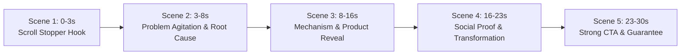

# Meta Ads Video AI Generation Skill

This skill autonomously creates high-converting **Meta Video Ad creative suites** for any product, e-commerce store, or SaaS offer. 

It crawls the product website to extract core value propositions, features, and social proof; downloads high-resolution reference images for **Image-to-Video (I2V)** conditioning; conducts deep competitor research using the **Facebook Ads Library Graph API**; and generates production-ready prompts for leading AI video generators (**Runway Gen-3 Alpha, Kling AI, Luma Dream Machine, Hailuo/Minimax, OpenAI Sora**) with complete synchronized voice-over audio scripts, on-screen captions, and compliant Meta ad copy packages.

---

## When to Activate

Activate this skill when:
- The user provides a product website, DTC landing page, or e-commerce store URL and asks for video ad prompts or video generation.
- The user says *"create a video ad for this website"*, *"make a Runway / Kling prompt for this product"*, or *"generate video ai prompts with voiceover and captions"*.
- The user triggers `/meta-video-ad-generator` or `/video-ad`.

---

## Quick Execution via CLI

The core engine is located at [`ads/video_ad_generator.js`](file:///Users/kirkzhang/Documents/Antigravity/ascendant_labs/ads/video_ad_generator.js).

### Primary Usage

Run via Node:
```bash
node ads/video_ad_generator.js "<PRODUCT_WEBSITE_URL>" [options]
```

Or via NPM shortcut:
```bash
npm run video:ad -- "<PRODUCT_WEBSITE_URL>" [options]
```

### CLI Flags

| Flag | Shorthand | Description | Default |
|---|---|---|---|
| `--url <url>` | `-u` | Product website URL | Target URL |
| `--max-pages <num>` | `-p` | Max internal pages to crawl | `6` |
| `--max-images <num>` | `-i` | Max reference images to download | `8` |
| `--countries <codes>` | `-c` | Target countries for Meta Ad Library API | `US,GB,CA,AU` |
| `--output <path>` | `-o` | Custom campaign directory path | `ads/campaigns/<slug>_meta_video_ads/` |
| `--skip-spy` | - | Skip Meta Ad Library API competitor research | `false` |
| `--help` | `-h` | Display usage instructions | - |

### Quick Examples

```bash
# Generate complete video ad suite for an ergonomic pillow:
node ads/video_ad_generator.js "https://derila-ergo.com"

# Generate video ad suite with 10 crawled pages and 12 reference images:
node ads/video_ad_generator.js "https://drinkag1.com" -p 10 -i 12

# Skip Meta Ads API if querying without internet or testing locally:
node ads/video_ad_generator.js "https://prodentim.com" --skip-spy
```

---

## Generated Campaign Directory Structure

Each run creates a dedicated, organized project directory under:
`ads/campaigns/<product_slug>_meta_video_ads/`

```text
ads/campaigns/<product_slug>_meta_video_ads/
├── 01_reference_images/
│   ├── ref_asset_01.png       <- Downloaded product hero shot
│   ├── ref_asset_02.png       <- Downloaded certifications & trust badges
│   └── ...                    <- Downloaded packaging, ingredients & diagrams
├── 02_market_research/
│   ├── meta_ads_inspiration.json <- Raw competitor ad data from Meta API
│   └── meta_ads_inspiration.md   <- Top winning competitor hooks & angles
├── 03_video_production_script.md <- UNIFIED: Video AI prompts, Voice-Over & Captions (Single 30s Variant)
└── 04_meta_ad_copy_package.md   <- Dedicated High-CTR Meta Ad Copy variants tailored for this video
```

---

## Video AI Prompting Standards

To produce photorealistic, professional video ads without distorted limbs or unnatural AI morphing, all generated prompts adhere to these specifications:

### 1. Camera & Motion Directives
- **Specify Camera Action First**: e.g., `[Camera: Fast forward punch zoom]`, `[Camera: Smooth 360 orbital macro pan, slow motion 60fps]`, `[Camera: Steady handheld smartphone POV]`.
- **Focal Length & Depth**: `35mm lens, f/1.8 shallow depth of field, creamy background blur`.
- **Lighting Dynamics**: `Warm golden-hour rim lighting, soft diffused morning window light, high-end studio lightbox`.
- **Framerate & Quality**: `4k 24fps photorealistic, natural film grain, zero motion blur`.
- **Aspect Ratios**:
  - `--ar 9:16` for Meta Reels, TikTok, and Instagram Stories.
  - `--ar 4:5` for Facebook and Instagram Mobile Feed.

### 2. Image-to-Video (I2V) Conditioning (Kling & Runway Gen-3)
- Users upload their product hero shot or reference image directly into the AI video generator UI as the start frame.
- Prompts are self-contained and clean without embedding local file path strings.

### 3. Universal Negative Prompt
Always paste this into the negative prompt input:
```text
blurry, morphing limbs, distorted fingers, extra hands, mutated face, plastic waxy skin, cartoon, 3D CGI animation, unnatural jerky camera shake, overexposed blowout, text artifacts, watermark, low resolution.
```

---

## Unified 30-Second Direct-Response Video Architecture

> [!IMPORTANT]
> The engine produces **ONLY ONE cohesive 30s video variant** combining Video AI Prompts, Voice-Over Audio, and On-Screen Captions directly per scene in `03_video_production_script.md`.
> Over **85% of Meta mobile feed viewers watch videos with sound muted**, so visual action, spoken audio, and text overlays are synchronized side-by-side.



Each scene in `03_video_production_script.md` provides:
1. **Video AI Prompt** (Runway Gen-3 / Sora text prompt + Kling / Luma I2V image conditioning prompt).
2. **Word-for-word Voice-Over Script** (for ElevenLabs or voice actor).
3. **On-Screen High-Contrast Caption** (for CapCut / Premiere overlay).

---

## Dedicated Meta Ad Copy Package (`04_meta_ad_copy_package.md`)

The ad copy is kept in a separate file specifically written to accompany and amplify this single video creative. It includes multiple split-test copy angles:
- **Variant 1**: UGC Epiphany & Personal Story (highest CTR, matches Scene 1 hook).
- **Variant 2**: Scientific Mechanism & Problem-Solution Contrast (matches Scene 2 & 3).
- **Variant 3**: Short Curiosity & Limited Offer Pattern-Interrupt (matches Scene 5 CTA).
- Compliant Headlines, Link Descriptions, CTA Button recommendations, and Meta Ad Policy Checklist.

---

## Agent Workflow Instructions

When the user asks you to create a Meta video ad or video AI prompts for a website:

1. **Extract Target Website**:
   - Get the URL from the prompt (e.g., `https://derila-ergo.com` or `https://prodentim101.com`).
   - If missing, prompt the user for the link.

2. **Execute Engine**:
   - Run the master script via `run_command`:
     ```bash
     node ads/video_ad_generator.js "<URL>"
     ```
   - The engine automatically:
     - Crawls internal links and parses product details.
     - Downloads high-resolution reference images to `01_reference_images/`.
     - Queries Facebook Ads Library API for competitor hooks.
     - Creates unified `03_video_production_script.md` and dedicated `04_meta_ad_copy_package.md`.

3. **Read Generated Files & Present to User**:
   - Read the generated files in the campaign directory.
   - Present a clear, actionable summary:
     - **Product Overview & Extracted Value Propositions**
     - **Competitor Hooks Discovered from Facebook Ads Library**
     - **Downloaded Reference Images Available for I2V**
     - **Unified Video Production Script (Scene-by-Scene: Prompt + VO + Caption for that 1 Video)**
     - **Continuous Voice-Over Script block**
     - **Meta Primary Ad Copy Packages (3 variants for this video)**
     - Direct file links to all assets in the campaign folder.
