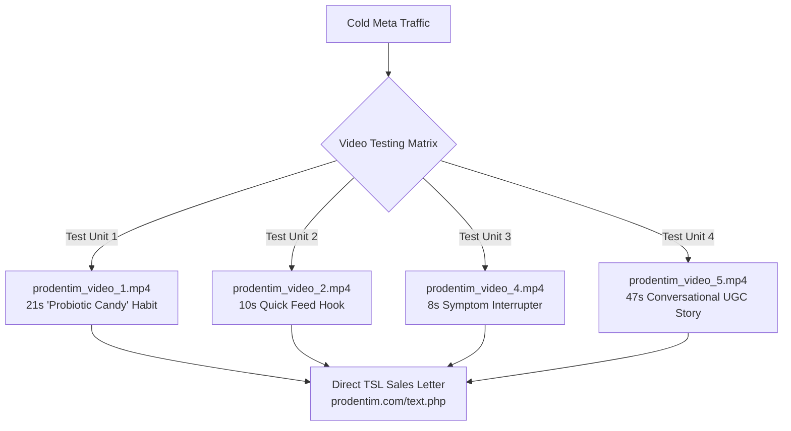

# 🎬 ProDentim UGC Video Creative Testing Matrix (Meta Ads 2026)
## Paring Downloaded UGC Videos with High-Converting Direct-Response Ad Creative Tests

This testing system pairs the **5 downloaded UGC videos** (located in `ads/prodentim/creatives/`) with custom-engineered ad copy, headlines, descriptions, and tracking tags designed for **Direct-to-TSL ClickBank Hoplinks**.

---

## 📊 Overview of UGC Video Creative Test Units



---

## 🧪 Test Unit 1: The 21-Second "Probiotic Candy" Routine Test

* **Video File:** [`prodentim_video_1.mp4`](file:///Users/kirkzhang/Documents/Antigravity/ascendant_labs/ads/prodentim/creatives/prodentim_video_1.mp4) (0.69 MB)
* **Poster Frame:** [`prodentim_video_1_poster.jpg`](file:///Users/kirkzhang/Documents/Antigravity/ascendant_labs/ads/prodentim/creatives/prodentim_video_1_poster.jpg)
* **Video Duration:** 21 seconds (UGC mobile format)
* **Visual Hook:** Creator holds a chewable tablet, demonstrates it dissolving, and shows morning routine.
* **Target Audience:** Men & Women 30–65+ looking for an easy, pleasant morning habit.
* **Recommended Placements:** Instagram Reels, Facebook Feeds, Stories.

### **Paired Ad Copy & Angle:**
```text
Bad breath and dull teeth? Brushing alone doesn't always cut it. 🦷✨

Your mouth has its own living bacteria balance, and that's the real key to a fresh, healthy smile.

That's why ProDentim—a daily chewable probiotic candy—is becoming everyone's new oral care habit.

Instead of harsh alcohol rinses that strip your mouth, this chewable lozenge repopulates your teeth and gums with 3.5 billion beneficial probiotics.

No mess. No harsh tastes. Just one mint tablet every morning.

Tap below to read the scientific presentation and see how it works 👇
```

* **Headline Variation A:** The Daily Probiotic Candy 🍬🦷
* **Headline Variation B:** A Simple Daily Oral Care Habit ✨
* **Description:** 3.5 Billion Good Bacteria • Dissolvable
* **CTA Button:** `Learn More` (or `Shop Now`)
* **Tracking Hoplink:**
  `https://[YOUR_AFFILIATE].prodentim.hop.clickbank.net/?cbpage=tsl&tid=vid1_candy_{{ad.id}}`

---

## 🧪 Test Unit 2: The 10-Second Rapid Interruption Test

* **Video Files:** [`prodentim_video_2.mp4`](file:///Users/kirkzhang/Documents/Antigravity/ascendant_labs/ads/prodentim/creatives/prodentim_video_2.mp4) (10 sec, 0.38 MB) & [`prodentim_video_3.mp4`](file:///Users/kirkzhang/Documents/Antigravity/ascendant_labs/ads/prodentim/creatives/prodentim_video_3.mp4) (10 sec, 0.36 MB)
* **Video Style:** Macro close-up texture + high-energy oral dissolve animation.
* **Objective:** Maximize Click-Through Rate (CTR) and deliver ultra-low Cost Per Click (CPC) across fast-scrolling mobile feeds.

### **Paired Ad Copy & Angle (Short-Form Punchy):**
```text
A simple addition to your morning oral-care routine. ☀️

Discover ProDentim: a dissolvable chewable probiotic designed to support a healthy oral environment from the inside out.

✔ 3.5 Billion CFUs of healthy flora
✔ Easy 10-second daily routine
✔ 100% natural peppermint flavor

Tap below to check current bottle discounts 👇
```

* **Headline Variation A:** Discover ProDentim 🦷
* **Headline Variation B:** Support Your Oral Microbiome Daily 🌿
* **Description:** Dissolvable Chewable Supplement
* **CTA Button:** `Learn More`
* **Tracking Hoplink:**
  `https://[YOUR_AFFILIATE].prodentim.hop.clickbank.net/?cbpage=tsl&tid=vid2_fast10s_{{ad.id}}`

---

## 🧪 Test Unit 3: The 8-Second Symptom Callout Test

* **Video File:** [`prodentim_video_4.mp4`](file:///Users/kirkzhang/Documents/Antigravity/ascendant_labs/ads/prodentim/creatives/prodentim_video_4.mp4) (8 sec, 0.40 MB)
* **Poster Frame:** [`prodentim_video_4_poster.jpg`](file:///Users/kirkzhang/Documents/Antigravity/ascendant_labs/ads/prodentim/creatives/prodentim_video_4_poster.jpg)
* **Visual Hook:** Direct problem callout addressing sensitive gums, morning breath, and mouth dryness.
* **Style:** High-contrast, scannable bullet points that convert cold skimmers.

### **Paired Ad Copy & Angle (Direct Problem/Solution):**
```text
🦷 Want Healthier Teeth and Gums Naturally?

If you’re tired of recurring bad breath, sensitive teeth, or bleeding gums when you brush, you are not alone.

Most dental products only mask the problem. ProDentim targets the root cause by repopulating your mouth with beneficial flora:

✅ Supports firm, healthy gums
✅ Freshens breath naturally from within
✅ Rebalances beneficial oral bacteria
✅ Easy, chewable daily lozenge

Don't wait until minor gum irritation becomes a serious dental issue.

Tap below to read the full scientific breakdown 👇
```

* **Headline Variation A:** Want Healthier Teeth and Gums? 🦷
* **Headline Variation B:** The Missing Link in Dental Care 🌿
* **Description:** Trusted by over 95,000 customers
* **CTA Button:** `Learn More`
* **Tracking Hoplink:**
  `https://[YOUR_AFFILIATE].prodentim.hop.clickbank.net/?cbpage=tsl&tid=vid4_symptom_{{ad.id}}`

---

## 🧪 Test Unit 4: The 47-Second Conversational UGC Test

* **Video File:** [`prodentim_video_5.mp4`](file:///Users/kirkzhang/Documents/Antigravity/ascendant_labs/ads/prodentim/creatives/prodentim_video_5.mp4) (47 sec, 1.23 MB)
* **Poster Frame:** [`prodentim_video_5_poster.jpg`](file:///Users/kirkzhang/Documents/Antigravity/ascendant_labs/ads/prodentim/creatives/prodentim_video_5_poster.jpg)
* **Visual Hook:** Authentic, front-facing creator talking casually into the camera about their frustration with brushing, flossing, and mouthwash.
* **Why This Scales:** Long hold-rate video builds massive trust, sending highly pre-qualified buyers to the sales page who convert at 2×–3× the normal rate.

### **Paired Ad Copy & Angle (The "Nagging Routine" Hook):**
```text
Brushing twice a day. Flossing (okay… most days). Mouthwash. 

And yet—that nagging feeling that your routine could still be doing more. 🤷‍♂️

That "more" is usually about balance. 

Your mouth runs on a living ecosystem of bacteria, and common harsh chemical rinses can accidentally wipe out the good guys.

ProDentim was formulated to do the opposite:
Pairing 3.5 billion CFUs of targeted probiotic strains (*L. paracasei*, *B.lactis*) with natural inulin and peppermint to support your mouth's natural defense system.

Not a replacement for your dentist. Not a magic cure. Just a smarter, more intentional way to round out what you're already doing every morning.

Tap below to see what people are saying and claim your supply 👇
```

* **Headline Variation A:** Still thinking about ProDentim? 🦷✨
* **Headline Variation B:** Brushing Twice a Day Isn't Enough
* **Description:** Save up to $780 on multi-bottle bundles
* **CTA Button:** `Learn More`
* **Tracking Hoplink:**
  `https://[YOUR_AFFILIATE].prodentim.hop.clickbank.net/?cbpage=tsl&tid=vid5_ugcstory_{{ad.id}}`

---

## 🚀 Recommended Meta Ads Manager Setup (DCT Video Split-Test)

To test which UGC video angle delivers the lowest Cost Per Purchase:

1. **Campaign Level:**
   * Objective: **Sales** (Optimized for Purchases on ClickBank via your Hoplink pixel/tracking).
   * Budget: CBO / Advantage Campaign Budget ($50–$100/day).
2. **Ad Set Level:**
   * Targeting: Broad (US, CA, UK, AU), Age 35–65+, All Genders.
   * Placements: Advantage+ Placements (automatic feed & reels optimization).
3. **Creative A/B Split Matrix:**
   * **Ad 1 (Candy Habit):** `prodentim_video_1.mp4` + Package 1 Copy + Hoplink `&tid=v1`
   * **Ad 2 (Quick Hook):** `prodentim_video_2.mp4` + Package 2 Copy + Hoplink `&tid=v2`
   * **Ad 3 (Symptom Callout):** `prodentim_video_4.mp4` + Package 3 Copy + Hoplink `&tid=v4`
   * **Ad 4 (Long UGC Story):** `prodentim_video_5.mp4` + Package 4 Copy + Hoplink `&tid=v5`
4. **Kill / Scale Rules:**
   * **Thumbstop Ratio (<25%):** If 3-second video views / impressions is under 25%, test a new first-3-second hook frame.
   * **Scale Winner:** The ad unit with the highest ClickBank initial sales and lowest CPC after 500 impressions gets 80% of budget.
