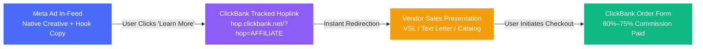

# 🎯 ClickBank Affiliate Meta Ad Creative & Copy Generation Master Playbook (2026 Edition)
## Direct-to-Affiliate Landing Page Funnel: Ad Creative Prompts, Direct-Response Copy Packages & AI Generation Engine

This playbook provides the complete system for generating **top-converting Meta Ad creatives (images & videos)** and **compliant direct-response ad copy** for ClickBank affiliate offers using the **Direct-to-Affiliate-Page (Direct Hoplink) Funnel**. 

It eliminates intermediate bridge pages to maximize conversion speed, incorporating real intelligence from hundreds of live, active affiliate campaigns scraped from the Meta Ad Library.

---

## 📑 Table of Contents
1. [Funnel Architecture: Direct Linking to the Affiliate Page](#1-funnel-architecture-direct-linking-to-the-affiliate-page)
2. [Direct Hoplink Setup, Tracking (`tid`) & Meta Ads Manager Config](#2-direct-hoplink-setup-tracking-tid--meta-ads-manager-config)
3. [The #1 Rule of Direct Linking: 1:1 Message Congruence](#3-the-1-rule-of-direct-linking-11-message-congruence)
4. [Visual Creative Styles & AI Image Generation Prompts (Flux / Midjourney)](#4-visual-creative-styles--ai-image-generation-prompts)
5. [Real Winning Direct-Link Ad Copy Packages (Live Meta Campaigns)](#5-real-winning-direct-link-ad-copy-packages)
   - [Niche A: DIY & Woodworking (Ted's Woodworking / Ted Plans)](#niche-a-diy--woodworking-teds-woodworking--ted-plans)
   - [Niche B: Physical Ergonomics & Sleep (Derila Ergo)](#niche-b-physical-ergonomics--sleep-derila-ergo)
   - [Niche C: Health & Natural Support (ProDentim / Oral Health)](#niche-c-health--natural-support-prodentim--oral-health)
   - [Niche D: Relationships & Psychology (His Secret Obsession)](#niche-d-relationships--psychology-his-secret-obsession)
6. [Master Plug-and-Play AI Generation Prompt for ANY ClickBank Product (Direct-Link Edition)](#6-master-plug-and-play-ai-generation-prompt-for-any-clickbank-product-direct-link-edition)
7. [Meta Ad Policy & Compliance Survival Rules for Direct Hoplinks](#7-meta-ad-policy--compliance-survival-rules-for-direct-hoplinks)
8. [Testing & Scaling Protocol: Dynamic Creative Testing (DCT 3:2:2)](#8-testing--scaling-protocol-dynamic-creative-testing-dct-322)

---

## ⚡ 1. Funnel Architecture: Direct Linking to the Affiliate Page

In the **Direct-to-Affiliate Funnel**, prospects tap your Meta ad and are taken **straight to the vendor's high-converting sales presentation or text letter (TSL/VSL)** via your ClickBank Hoplink. There is **no middle bridge page, pre-sell article, or opt-in barrier**.



### 💡 Why Direct Linking Wins When Executed Correctly:
1. **Zero Intermediate Drop-Off**: Pre-sell bridge pages lose **40% to 65%** of clicks between the bridge and the sales page. Direct linking delivers **100% of your paid traffic directly into the vendor’s sales mechanism**.
2. **Leverages Proven Multi-Million Dollar Copy**: Top vendors spend hundreds of thousands of dollars split-testing their Video Sales Letters (VSLs) and headline hooks. Direct traffic taps straight into that optimization.
3. **Faster Testing & Lower Operational Drag**: You don’t need to design, host, or maintain custom landing pages, WordPress sites, or servers. You only focus on testing **creatives, hooks, and targeting**.

---

## 🔗 2. Direct Hoplink Setup, Tracking (`tid`) & Meta Ads Manager Config

### 1. Hoplink Formats:
ClickBank supports direct affiliate routing using either standard hoplinks or direct vendor-parameter URLs:

- **Standard ClickBank Hoplink**:
  ```text
  https://[YOUR_AFFILIATE_ID].[VENDOR_ID].hop.clickbank.net/?tid={{campaign.name}}_{{adset.name}}_{{ad.id}}
  ```
- **Modern Encrypted Hoplink** *(Generated in ClickBank Marketplace)*:
  ```text
  https://[encrypted_id].hop.clickbank.net/?tid={{ad.id}}
  ```
- **Vendor Direct Custom Sub-Pages** *(Direct VSL, Text Presentation, or Discount Page)*:
  Many top ClickBank vendors allow direct URLs with the `hop` query parameter:
  - Ted's Woodworking: `https://tedplansdiy.com/?hop=[YOUR_AFFILIATE_ID]&tid={{ad.id}}`
  - ProDentim Text Version: `https://prodentim.com/text.php?hop=[YOUR_AFFILIATE_ID]&tid={{ad.id}}`
  - Derila Ergo: `https://derila-ergo.com/derila-ergo/product?ang=clickbank&hop=[YOUR_AFFILIATE_ID]&tid={{ad.id}}`
  - His Secret Obsession: `https://hissecretobsession.com/freepresentation.php?hop=[YOUR_AFFILIATE_ID]&tid={{ad.id}}`

### 2. Meta Ads Manager Link Settings:
When setting up your ad in Meta Ads Manager:
- **Website URL**: Enter your full tracked hoplink:
  `https://[YOUR_AFFILIATE_ID].[VENDOR_ID].hop.clickbank.net/?tid={{ad.id}}`
- **Display Link** *(Optional / Recommended)*: Enter the clean final vendor domain (e.g., `tedplansdiy.com` or `derila-ergo.com`). This ensures the ad card displays a clean, trustworthy domain to users in the feed.
- **Call-to-Action (CTA)**: Use `Learn More` (delivers the lowest CPC and highest CTR across direct affiliate campaigns).

---

## 🎯 3. The #1 Rule of Direct Linking: 1:1 Message Congruence

Because the user does not see an intermediary bridge page to warm them up, **the transition from your ad to the vendor's page must feel seamless**.

```text
┌─────────────────────────────────────────────────────────────┐
│ 🔴 THE DEADLY MISMATCH (80%+ Bounce Rate):                  │
│ • Ad: "How to fix neck pain in 3 minutes"                   │
│ • Landing Page: "Buy this $49 memory foam butterfly pillow" │
│ ➔ User feels misled, clicks back immediately.              │
├─────────────────────────────────────────────────────────────┤
│ 🟢 1:1 DIRECT-LINK CONGRUENCE (High Conversion):            │
│ • Ad: "Why standard pillows collapse — and why contour      │
│   memory foam keeps your neck aligned all night long"       │
│ • Landing Page: "Derila: The Ergonomic Contour Pillow"      │
│ ➔ User gets exactly what the ad promised.                   │
└─────────────────────────────────────────────────────────────┘
```

### Direct-Link Congruence Checklist:
1. **Match the Landing Page Headline**: If the vendor's headline is *"16,000 Step-By-Step Woodworking Plans"*, your ad hook must introduce *"step-by-step woodworking plans"*.
2. **Match the Visual Tone**: If the vendor's VSL features a workshop, your ad creative must be a realistic workshop scene.
3. **Pre-Frame the Format**: Let the user know what to expect when they click (e.g., *"Watch the free video demonstration below 👇"* or *"See the full catalog of plans 👇"*).

---

## 🎨 4. Visual Creative Styles & AI Image Generation Prompts

Standard cartoon graphics or glossy generic stock photos generate **banner blindness** on Meta feeds. The top 4 visual formats for direct ClickBank affiliate traffic are built around **Authentic Native Realism**:

```text
┌─────────────────────────────────────────────────────────────┐
│ 👤 Smart Projects • Sponsored                            ...│
│ 📝 I didn’t know you could actually build this yourself...  │
├─────────────────────────────────────────────────────────────┤
│                                                             │
│         [ AUTHENTIC WORKBENCH / HANDHELD SNAPSHOT ]         │
│                                                             │
│          Realistic natural daylight, sawdust, warm pine     │
│         Clear blueprint paper with clean exploded diagram    │
│           Hands holding a finished handcrafted piece        │
│                                                             │
├─────────────────────────────────────────────────────────────┤
│ 🔨 See What You Can Build                                   │
│    hop.clickbank.net                                        │
│    [ Learn More ] <── Direct to TedPlansDIY                 │
└─────────────────────────────────────────────────────────────┘
```

### Style 1: The Native Handheld / Workbench Proof (DIY / Crafts)
- **Concept**: A first-person POV smartphone snapshot of a woodcrafter's hands holding a cleanly finished, beautiful project on a real wooden workbench, with blueprint plans spread out beneath it.
- **Midjourney v6 / Flux Prompt**:
  ```text
  First-person POV candid iPhone photography of a craftsman holding a beautifully finished handcrafted wooden desk organizer on a workshop table, scattered blueprint drawings and carpenter pencil visible in the background, sawdust shavings, warm natural garage morning sunlight, shallow depth of field, hyper-realistic, authentic homemade DIY aesthetic, no stock photo look, 35mm lens --ar 1:1 --v 6.0 --style raw
  ```
- **Story/Reels 9:16 Aspect Ratio Prompt**:
  ```text
  Vertical candid smartphone snapshot of an amateur woodworker smiling in an organized home garage workshop, standing next to a finished handmade outdoor Adirondack chair, blueprint plans resting on a workbench, realistic natural afternoon lighting, authentic everyday hobbyist, 8k resolution, documentary photography --ar 9:16 --v 6.0 --style raw
  ```

### Style 2: The "Split-Reality: Flaw vs. Solution" (Ergonomics / Physical Products)
- **Concept**: Side-by-side split visual contrasting the cause of discomfort (e.g., flat collapsed pillow with bent neck posture diagram) against the ergonomic contoured solution.
- **Midjourney v6 / Flux Prompt**:
  ```text
  Clean split-screen medical editorial aesthetic, left side showing a person sleeping on a flat collapsed conventional pillow with their neck bent unnaturally highlighted by a subtle red alignment curve, right side showing a person resting peacefully on a modern ergonomic butterfly contour memory foam pillow with their spine in perfect neutral alignment highlighted by a calm blue glow, soft bedroom morning light, Scandinavian interior, minimalist clean graphic --ar 1:1 --v 6.0
  ```

### Style 3: The Plain-English Checklist / Technical Cut-Sheet (High Curiosity)
- **Concept**: An authentic close-up of an exploded 3D blueprint sheet with clear dimensions, cut lists, and a handwritten yellow post-it note: *"Total build cost: $38. Time: 3 hours."*
- **Midjourney v6 / Flux Prompt**:
  ```text
  Macro shot of an architectural woodworking blueprint cut-sheet lying flat on a rustic workbench, crisp black-and-white 3D exploded diagram of a small garden shed, a yellow sticky note stuck to the corner reading "Beginner Project: 3 hours", pencil markings and measuring tape next to it, crisp focus, soft natural daylight, high resolution architectural photography --ar 4:5 --v 6.0 --style raw
  ```

### Style 4: Minimalist Natural Daily Habit Flatlay (Health & Wellness)
- **Concept**: Clean Scandinavian wooden table with morning glass of water, fresh mint leaves, natural botanicals, and an elegant chewable tablet. Feels like a lifestyle editorial, not an infomercial.
- **Midjourney v6 / Flux Prompt**:
  ```text
  Warm aesthetic editorial flatlay on a light oak table, a glass of crystal clear water with fresh mint and lemon slice, a small natural ceramic dish holding two clean white chewable tablets, morning sunlight casting gentle shadows, minimalist wellness magazine photography, calm organic vibe, 50mm lens, f/2.8 --ar 1:1 --v 6.0
  ```

---

## ✍️ 5. Real Winning Direct-Link Ad Copy Packages

*(Verbatim formats extracted from the 500-ad intelligence dump of active Meta Ads Library campaigns driving direct ClickBank hoplinks)*

### Niche A: DIY & Woodworking (Ted's Woodworking / Ted Plans)

#### 📦 Package 1: The "Beginner Epiphany" Hook *(Smart Projects Live Winning Campaign)*
- **Primary Text**:
  > I didn’t know you could actually build something like this yourself… 🪵
  > 
  > I always thought woodworking was complicated, but these step-by-step plans make it way easier than I expected.
  > 
  > Even beginners can follow along.
  > 
  > If you’re curious what you can build, check it out below 👇
- **Headline**: See What You Can Build 🔨
- **Description**: Step-by-step plans for 16,000+ DIY projects
- **CTA Button**: Learn More
- **Direct Hoplink**: `https://[YOUR_AFFILIATE].tedsplans.hop.clickbank.net/?tid={{ad.id}}`
- **Matching Vendor Landing Page**: `https://tedplansdiy.com/?hop=[YOUR_AFFILIATE]`

#### 📦 Package 2: The "Wasted Lumber & Missing Measurements" Angle
- **Primary Text**:
  > The most frustrating part of starting a woodworking project is getting halfway through and realizing the measurements don't add up. 📐
  > 
  > Most free plans online leave out critical cutting lists and 3D diagrams, leaving you with wasted timber and hours of guesswork.
  > 
  > Master craftsman Ted McGrath compiled an archive of 16,000 shop-tested blueprints with complete material cut-lists and exploded views so simple *the project builds itself*.
  > 
  > Tap below to browse the plan catalog and see what you can build this weekend 👇
- **Headline**: Never Guess A Measurement Again 📐
- **Description**: 16,000 Shop-Tested Plans • Instant Access
- **CTA Button**: Learn More
- **Direct Hoplink**: `https://[YOUR_AFFILIATE].tedsplans.hop.clickbank.net/?tid={{ad.id}}`

---

### Niche B: Physical Ergonomics & Sleep (Derila Ergo)

#### 📦 Package 1: The "Spouse Stopped Snoring" Story Hook *(Deal Of The Day Live Campaign)*
- **Primary Text**:
  > My husband stopped snoring on a Tuesday. 
  > 
  > I know, because I was awake for all of it, waiting for the familiar rattling to start. It never did. 😴
  > 
  > For years, we thought it was just exhaustion. But it turned out to be how his head and neck were positioned every single night.
  > 
  > Most ordinary pillows collapse into a shapeless slab after 30 minutes, tilting your head and restricting your airway.
  > 
  > The Derila butterfly contour is engineered from high-density memory foam that supports your cervical spine in neutral alignment all night long.
  > 
  > If you’re tired of restless nights, see how the contour shape works 👇
- **Headline**: Back in the same bedroom ✨
- **Description**: High-density contour memory foam support
- **CTA Button**: Learn More
- **Direct Hoplink**: `https://[YOUR_AFFILIATE].derila.hop.clickbank.net/?tid={{ad.id}}`

#### 📦 Package 2: "Stop Replacing. Start Supporting." *(Deal Of The Day Live Campaign)*
- **Primary Text**:
  > Why do we keep buying pillows that go flat in a month — and then blame our necks? 🤦
  > 
  > I did it three times. Each one arrived plump, lasted a few weeks, then packed down into the same shapeless slab. And every morning my neck paid for it.
  > 
  > Here's the part nobody tells you: an ordinary pillow has zero structure. Your head sinks until your spine spends 8 hours bent sideways. You can't out-stretch that in the morning.
  > 
  > What I ended up with isn't a softer pillow or a bigger one. It's a shaped one — a butterfly contour in high-density foam that decides the position for you.
  > 
  > Fix the 8 hours, not the ache. See how the shape works 👇
- **Headline**: It was the pillow all along 🛌
- **Description**: Fix the 8 hours, not the ache
- **CTA Button**: Learn More
- **Direct Hoplink**: `https://[YOUR_AFFILIATE].derila.hop.clickbank.net/?tid={{ad.id}}`

---

### Niche C: Health & Natural Support (ProDentim / Oral Health)

#### 📦 Package 1: The Oral Microbiome Habit *(Dylan Parker / ProDentim Live Campaign)*
- **Primary Text**:
  > Most people assume dental hygiene stops at brushing and flossing. 🌿
  > 
  > But recent research into the oral microbiome suggests that many common chemical rinses strip away the *beneficial* bacteria your mouth needs to protect your teeth and gums.
  > 
  > ProDentim is a daily chewable tablet combining 3.5 billion CFUs of targeted beneficial probiotics (*Lactobacillus paracasei*, *B.lactis*) and natural botanical nutrients.
  > 
  > Read the full clinical breakdown and discover how this 10-second morning habit supports fresh breath and healthy gums 👇
- **Headline**: The Oral Microbiome Chewable 🦷
- **Description**: 3.5 Billion CFUs of beneficial probiotics
- **CTA Button**: Learn More
- **Direct Hoplink**: `https://[YOUR_AFFILIATE].prodentim.hop.clickbank.net/?tid={{ad.id}}`
- **Direct Text Version**: `https://prodentim.com/text.php?hop=[YOUR_AFFILIATE]&tid={{ad.id}}`

---

### Niche D: Relationships & Psychology (His Secret Obsession)

#### 📦 Package 1: The "Hero Instinct" Presentation Hook *(Attraction Lab Live Campaign)*
- **Primary Text**:
  > Most relationship advice tells you to text slower or play hard to get. None of that actually addresses how male emotional attraction works.
  > 
  > Relationship counselor James Bauer discovered a primal biological drive embedded in masculine psychology that most women have never heard of.
  > 
  > When a man feels truly needed, admired, and essential to your world, his commitment becomes effortless.
  > 
  > Watch the free presentation to learn the subtle communication signals that trigger this response:
- **Headline**: The Signal Every Man Responds To 💭
- **Description**: Free video presentation by James Bauer
- **CTA Button**: Watch More / Learn More
- **Direct Hoplink**: `https://[YOUR_AFFILIATE].secretobs.hop.clickbank.net/?tid={{ad.id}}`
- **Direct Presentation URL**: `https://hissecretobsession.com/freepresentation.php?hop=[YOUR_AFFILIATE]&tid={{ad.id}}`

---

## 🤖 6. Master Plug-and-Play AI Generation Prompt for ANY ClickBank Product (Direct-Link Edition)

Copy and paste this prompt into Gemini, Claude, or ChatGPT whenever you want to generate a complete Meta ad creative suite that links **directly to a ClickBank affiliate sales page**:

````markdown
You are an elite Meta Direct-Response Creative Strategist and Copywriter specializing in direct-to-affiliate-page advertising (driving cold Meta traffic directly to ClickBank vendor sales pages without an intermediary bridge page).

I need a complete Meta Ad Creative & Copy Suite for the following ClickBank product:

- **Product Name**: [Insert Product Name, e.g., Ted's Woodworking / Derila / ProDentim]
- **Vendor Pitch / Core Mechanism**: [Insert what the product does or paste the vendor sales page headline/hook]
- **Target Vendor URL**: [e.g., https://tedplansdiy.com or https://prodentim.com/text.php]
- **Target Customer Demographic**: [e.g., Men 35-65 interested in DIY / Women 30-55 seeking better sleep]

Please generate the following assets designed for 100% direct-link congruence:

### 1. Direct-Link Congruence Strategy:
- Identify the exact core hook from the vendor's landing page.
- Explain how the ad copy and visuals will create a 1:1 seamless bridge to the vendor page so the user doesn't bounce upon landing.

### 2. 3 AI Image Generation Prompts (for Midjourney v6 and Flux):
- Visual formats must feel like authentic native social posts (UGC, first-person workbench/lifestyle proof, or clean split-screen diagrams) — ZERO cartoonish graphics or stock photo look.
- Output exact prompt strings with aspect ratios (--ar 1:1 and --ar 4:5), camera specs (lens, lighting, shot type), and realism directives.

### 3. 3 Complete Meta Ad Copy Packages (Short, Medium, Story):
For each package, provide:
- **Primary Text**: Opening hook (scroll-stopper), body with high-contrast bullet points/scannable layout, and clear call-to-action directing the user to the link below.
- **Headline (Title)**: Under 45 characters, high curiosity or direct benefit, includes 1 Unicode emoji.
- **Link Description**: Under 35 characters highlighting the offer/format (e.g., "16,000 Step-By-Step Plans • Instant Download").
- **Recommended Meta CTA Button**: [Learn More / Watch More / Shop Now]
- **Direct Hoplink Format**: Ready-to-use URL structure with tracking macro.

### 4. Meta Policy Compliance Guardrails:
- List any prohibited words, sensitive personal attribute questions ("Do you have..."), or unrealistic guarantees to avoid in Meta Ads Manager for this specific niche.
````

---

## ⚖️ 7. Meta Ad Policy & Compliance Survival Rules for Direct Hoplinks

When linking directly to affiliate offers, Meta's automated crawlers inspect the destination URL and final redirect page. Follow these 5 rules to protect your ad account:

1. **Avoid Sensitive Personal Attribute Language**:
   - ❌ Never ask: *"Are you suffering from chronic back pain or ugly teeth?"* (Direct violation of Meta's Personal Health policy).
   - ✅ Use observational or third-person story framing: *"Why thousands of sleepers are upgrading to butterfly contour support..."* or *"Most people assume dental hygiene stops at brushing..."*.
2. **Never Guarantee Unrealistic Timeframes or Medical Cures**:
   - ❌ *"Cure tinnitus in 7 days"* or *"Guaranteed to make $500/day"*.
   - ✅ Focus on the craftsmanship, the ergonomic design, or natural botanical ingredients.
3. **Use the "Text Presentation" (TSL) Variant for Health/Supplements**:
   - High-energy VSLs often contain aggressive claims that can trigger Meta crawlers. Top affiliates driving direct traffic to health offers (like ProDentim) link directly to the **Text Presentation page** (e.g., `/text.php`), which is clean, calm, and 100% compliant.
4. **Display Link Transparency**:
   - Always set the **Display Link** in Meta Ads Manager to match the clean destination domain where the user will land after the hoplink redirects (e.g., `tedplansdiy.com`).
5. **Ensure the Vendor Landing Page Has Compliance Footers**:
   - Verify that the vendor page has working Privacy Policy, Terms of Service, and Disclaimer links in the footer. All major ClickBank top-ranked products meet this standard natively.

---

## 📊 8. Testing & Scaling Protocol: Dynamic Creative Testing (DCT 3:2:2)

### 🔗 Hoplink Tracking Token Setup:
Always pass Meta's automated macros in your hoplink `tid` query parameter to track which specific creative generated each sale inside ClickBank analytics:

```text
https://[YOUR_AFFILIATE].[VENDOR_ID].hop.clickbank.net/?tid={{ad.id}}_{{adset.name}}_{{campaign.name}}
```

### 🧪 The DCT 3:2:2 Direct-Link Launch Framework:
Inside Meta Ads Manager, launch a **Dynamic Creative Ad Set** targeting broad interest audiences (e.g., *Woodworking*, *Carpentry*, *Home improvement* or *Sleep*, *Memory foam*):

| Element | Quantity | Specific Asset |
| :--- | :---: | :--- |
| **Creatives** | **3** | 1 Handheld Proof + 1 Split-Reality Diagram + 1 Cut-Sheet/Checklist |
| **Primary Texts** | **2** | 1 Native Story/Epiphany Hook + 1 Direct Frustration/Solution Hook |
| **Headlines** | **2** | 1 Curiosity Hook + 1 Direct Benefit Hook |
| **CTA Button** | **1** | `Learn More` |

- **Daily Test Budget**: $25 – $50/day.
- **Evaluation Benchmark**:
  - **Outbound CTR**: > 2.5% (Winning creatives hit 3.5%–5%+).
  - **Cost-Per-Outbound-Click (CPC)**: < $0.60 – $0.90 USD on Tier-1 traffic (US, UK, CA, AU).
  - **ClickBank Hop Count**: Cross-reference Meta outbound clicks with ClickBank vendor dashboard hops to verify 90%+ hop tracking efficiency.
- **Graduation to Scaling**: Extract the winning ad post ID that generates initial front-end sales and move it into a dedicated **Advantage+ Budget / CBO Scaling Campaign**.
