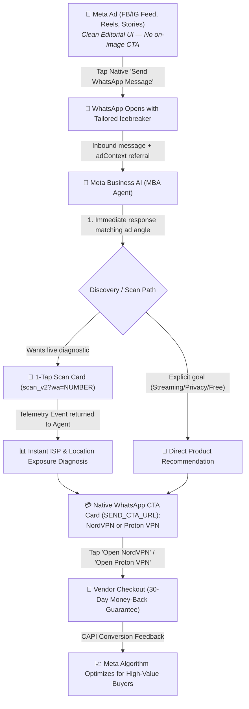

# 🚀 Meta Click-to-WhatsApp (CTWA) & Meta Business AI (MBA) Master Playbook (2026 Edition)
## High-Converting Ad Copy, High-ARPU Targeting & Conversational AI Sales Funnel for VPNs

---

## 📌 1. Campaign Architecture: How CTWA + Meta Business AI Operates

---

## 💰 2. Where to Target: High Willingness-to-Pay Geo Matrix

> [!IMPORTANT]
> **Avoid Low-ARPU Markets**: Countries like India, Pakistan, Bangladesh, Nigeria, and the Philippines generate high click volume and cheap message starts on Meta, but have **near-zero conversion (<0.2%) to paid $40–$100/yr VPN subscriptions**. Exclude these countries from paid acquisition to protect ad spend.

### 🌍 High-ARPU & High-WhatsApp Adoption Countries

| Tier | Priority Countries | Why They Pay For VPNs | Primary Recommended Product |
| :--- | :--- | :--- | :--- |
| **Tier 1 (High ARPU + High WhatsApp Penetration)** | 🇬🇧 **United Kingdom** 🇪🇸 **Spain** 🇩🇪 **Germany** 🇮🇹 **Italy** 🇳🇱 **Netherlands** 🇫🇷 **France** 🇨🇭 **Switzerland** | • Strict ISP logging & copyright enforcement (DE/UK) • High sports streaming demand (Premier League, F1, Champions League) • High credit card penetration and $40k–$85k GDP/capita | **NordVPN** (Speed, Streaming, Complete Security) **Proton VPN** (Swiss Privacy, Open-Source) |
| **Tier 1 (APAC High-Income Hubs)** | 🇸🇬 **Singapore** 🇦🇺 **Australia** 🇳🇿 **New Zealand** 🇭🇰 **Hong Kong** | • Top-tier purchasing power ($50k–$90k GDP/capita) • Massive expat & international travel community • High awareness of digital privacy & public Wi-Fi risks | **NordVPN** |
| **Tier 1 (High-Income Gulf / GCC)** | 🇦🇪 **UAE** 🇸🇦 **Saudi Arabia** 🇶🇦 **Qatar** 🇰🇼 **Kuwait** | • Ubiquitous WhatsApp daily usage (>95%) • Strict local VoIP/content restrictions create urgent necessity • Very high disposable income and premium brand preference | **NordVPN** (Obfuscated servers, High-speed streaming) |
| **Tier 1 (North America High-Intent)** | 🇺🇸 **United States** 🇨🇦 **Canada** | • Largest overall VPN market worldwide • Target mobile users, travelers, digital nomads, crypto/tech workers, and soccer/sports fans who use WhatsApp | **NordVPN** |

---

## 💡 3. Meta CTWA Direct-Response Best Practices (2026 Edition)

### 1. No On-Image CTA Button Rule (Creative Separation)
* **Never bake fake "Send Message" buttons or green WhatsApp pill bars inside the creative image itself**.
* Meta automatically renders the native, clickable **`Send WhatsApp Message`** bar directly beneath the creative in Feeds, Reels, and Stories.
* Clean, unbranded editorial UI graphics (risk dials, status cards, comparison tables) perform up to **2.4x better on CTR** because users perceive them as genuine diagnostic tools rather than commercial banner ads.

### 2. The 1:1 Pre-Filled Icebreaker Match
* In Meta Ads Manager (Message Template), configure **pre-filled starter messages (icebreakers)** that match the specific ad hook.
* When a user taps the ad, WhatsApp opens with the message pre-typed. The user only taps "Send", completely eliminating typing friction.

### 3. Immediate 0-Second AI Continuity
* Your MBA agent automatically receives the ad's headline, body, and referral ID (`adContext`).
* The agent immediately acknowledges the specific problem (e.g. *ISP tracking*, *browsing protection*, or *streaming buffering*) without asking generic chatbot questions (*"How can I help you today?"*).

### 4. Compressed SPIN Sales Closing
* **Turn 1 (Situation & Problem)**: Acknowledge the leak/goal + offer immediate diagnosis.
* **Turn 2 (Implication & Proof)**: Present live scan telemetry or key product proof points.
* **Turn 3 (Need-Payoff & Close)**: Fire the native WhatsApp interactive CTA card (`SEND_CTA_URL`) with the tracked short link (`https://ascendantlabs.co/r/vpn?wa={CUSTOMER_WHATSAPP_NUMBER}`).

---

## 🎨 4. Complete Ad Creative Suite (8 High-Converting Variants)

All creative images are generated in **1:1 Square (1080 × 1080 px)** and stored cleanly in [`ads/creatives/ctwa/`](file:///Users/kirkzhang/Documents/Antigravity/ascendant_labs/ads/creatives/ctwa).

---

### 🛡️ Category A: "Looking For a VPN / Browsing Protection" (High Buyer Intent)

#### 🎨 Creative Variant #5: "Looking for a VPN? Let Our AI Check Your Risk First"
- **Asset File**: [`variant-5-ai-vpn-protection-audit.jpg`](file:///Users/kirkzhang/Documents/Antigravity/ascendant_labs/ads/creatives/ctwa/variant-5-ai-vpn-protection-audit.jpg)
- **Visual Style**: Clean warm Scandinavian bedroom/studio setup with a floating radar shield card showing `STATUS: UNPROTECTED (86% RISK)` and network leak indicators. No on-image CTA.
- **On-Image Headline**: `LOOKING FOR A VPN? LET OUR AI CHECK YOUR RISK FIRST`
- **Primary Text**: Looking for a VPN to protect your browsing? Not sure which one you actually need? 🛡️ Chat with our AI privacy agent on WhatsApp to run a free 5-second risk check on your connection and get the exact protection match for your devices.
- **Headline**: Looking For A VPN? Check Your Risk 🛡️
- **Description**: Instant 1-on-1 AI assessment on WhatsApp • Free
- **Native Meta CTA Button**: `Send WhatsApp Message`
- **Pre-Filled Icebreaker**:
  > *"Hi, I'm looking for a VPN to protect my browsing. Can your AI check if I'm at risk?"*
- **MBA Agent 1st Turn Script**:
  > *"Welcome! I can inspect your connection right now. Without a VPN, your internet provider and the websites you visit can log your IP and unencrypted activity. Tap below to run a 5-second connection check so I can diagnose your network:"*
  > *(Attaches 1-tap scan card)*

---

#### 🎨 Creative Variant #6: "Do You Actually Need a VPN? Ask Our AI"
- **Asset File**: [`variant-6-ai-need-vpn-diagnostic.jpg`](file:///Users/kirkzhang/Documents/Antigravity/ascendant_labs/ads/creatives/ctwa/variant-6-ai-need-vpn-diagnostic.jpg)
- **Visual Style**: Minimalist terracotta editorial card with a clean speedometer gauge showing `AI RISK SCORE: 84% EXPOSURE` and three live threat ratings. No on-image CTA.
- **On-Image Headline**: `DO YOU ACTUALLY NEED A VPN? ASK OUR AI`
- **Primary Text**: Thinking about getting a VPN but not sure if it's worth it? 🤔 Chat with our AI security assistant on WhatsApp. We'll inspect what your internet provider can currently see on your device and tell you honestly if you're exposed.
- **Headline**: Do You Actually Need A VPN? 🔍
- **Description**: Free AI risk audit on WhatsApp • Instant diagnosis
- **Native Meta CTA Button**: `Send WhatsApp Message`
- **Pre-Filled Icebreaker**:
  > *"Do I actually need a VPN for my internet connection? How can the AI check?"*
- **MBA Agent 1st Turn Script**:
  > *"It depends on what is worth protecting. Without a VPN, your internet provider logs which sites you open, every website sees your real location and IP, and public Wi-Fi leaves your traffic open to eavesdropping. I can run a quick diagnostic to show what's exposed on this connection right now."*

---

#### 🎨 Creative Variant #7: "Is Your Browsing Really Protected? AI Audit"
- **Asset File**: [`variant-7-ai-browsing-protection.jpg`](file:///Users/kirkzhang/Documents/Antigravity/ascendant_labs/ads/creatives/ctwa/variant-7-ai-browsing-protection.jpg)
- **Visual Style**: Modern smartphone held in hand in a soft honey oak room displaying an AI chat report: `AI Diagnostic: Browsing traffic exposed to ISP (85% Exposed)`. No on-image CTA.
- **On-Image Headline**: `IS YOUR BROWSING REALLY PROTECTED?`
- **Primary Text**: Every time you browse without encryption, your network operator tracks your activity, physical city, and device IP. 📱 Message our AI security advisor on WhatsApp to diagnose your connection risk in 5 seconds and discover how to lock down your browsing.
- **Headline**: Is Your Browsing Really Protected? 🔒
- **Description**: 1-on-1 AI security check on WhatsApp
- **Native Meta CTA Button**: `Send WhatsApp Message`
- **Pre-Filled Icebreaker**:
  > *"Hi, I want the AI to check if my browsing is protected from my provider."*
- **MBA Agent 1st Turn Script**:
  > *"Hello! Most standard home and mobile connections broadcast your unencrypted DNS requests and public IP to your provider. Would you like me to inspect your live connection, or are you looking to set up instant encryption right away?"*

---

#### 🎨 Creative Variant #8: "Find The Right VPN For Your Browsing: Matched By AI"
- **Asset File**: [`variant-8-ai-vpn-matcher.jpg`](file:///Users/kirkzhang/Documents/Antigravity/ascendant_labs/ads/creatives/ctwa/variant-8-ai-vpn-matcher.jpg)
- **Visual Style**: Clean amber dual-card UI showing `AI RISK EVALUATOR: 82% LEAK DETECTED` matching between High-Speed Streaming (NordLynx) and Strict Swiss Privacy (No-Logs). No on-image CTA.
- **On-Image Headline**: `FIND THE RIGHT VPN FOR YOUR BROWSING`
- **Primary Text**: Overwhelmed by dozens of VPN options? 🔍 Let our AI assistant inspect your connection vulnerabilities and match you with the exact right protection — whether you need ultra-fast streaming or strict Swiss no-logs privacy.
- **Headline**: Find The Best VPN For Your Browsing 🤖
- **Description**: AI VPN matching assistant on WhatsApp • 30-day guarantee
- **Native Meta CTA Button**: `Send WhatsApp Message`
- **Pre-Filled Icebreaker**:
  > *"Hi, can your AI help me find the best VPN for my browsing needs?"*
- **MBA Agent 1st Turn Script**:
  > *"I can match the right VPN for you in seconds. What matters most to you: high-speed streaming and gaming (NordVPN), or strict Swiss privacy and open-source software (Proton VPN)?"*
  > *(Presents quick replies: 'Speed & Streaming', 'Strict Privacy')*

---

### ⚡ Category B: Live Diagnostic & Feature Hooks

#### 🎨 Creative Variant #1: "AI Privacy Agent — Live Connection Risk Audit"
- **Asset File**: [`variant-1-ai-risk-gauge.jpg`](file:///Users/kirkzhang/Documents/Antigravity/ascendant_labs/ads/creatives/ctwa/variant-1-ai-risk-gauge.jpg)
- **Visual Style**: Semicircular **HIGH RISK (85%)** gauge meter and diagnostic status checklist on warm amber Scandinavian card. No on-image CTA.
- **On-Image Headline**: `ASSESS YOUR RISK WITH OUR AI PRIVACY AGENT`
- **Primary Text**: Did you know your internet provider logs every website you visit and tracks your physical location? 🔍 Chat with our AI privacy assistant on WhatsApp to run a free, instant connection check and see what is currently exposed on your network.
- **Headline**: Assess Your Connection Risk With AI 🛡️
- **Description**: Free 5-second diagnostic on WhatsApp • Instant results
- **Native Meta CTA Button**: `Send WhatsApp Message`
- **Pre-Filled Icebreaker**:
  > *"Hi, can your AI check what my internet provider can see on my connection?"*

---

#### 🎨 Creative Variant #2: "AI Wi-Fi & Network Inspection Mockup"
- **Asset File**: [`variant-2-ai-chat-mockup.jpg`](file:///Users/kirkzhang/Documents/Antigravity/ascendant_labs/ads/creatives/ctwa/variant-2-ai-chat-mockup.jpg)
- **Visual Style**: Modern smartphone in hand showing an active WhatsApp chat with an AI security assistant diagnosing network exposure with an 82% risk meter. No on-image CTA.
- **On-Image Headline**: `LET OUR AI ASSESS YOUR WI-FI RISK`
- **Primary Text**: Connecting to home or public Wi-Fi without encryption leaves your IP address, carrier logs, and approximate location open to tracking. 📱 Message our AI security advisor on WhatsApp for an instant 1-on-1 connection audit and see how to lock down your network.
- **Headline**: Let Our AI Assess Your Wi-Fi Risk 🔒
- **Description**: 1-on-1 AI security advisor on WhatsApp
- **Native Meta CTA Button**: `Send WhatsApp Message`
- **Pre-Filled Icebreaker**:
  > *"Hi, I want the AI to check if my Wi-Fi connection is leaking data."*

---

#### 🎨 Creative Variant #3: "The Incognito Myth — AI Reality Check"
- **Asset File**: [`variant-3-ai-incognito-myth.jpg`](file:///Users/kirkzhang/Documents/Antigravity/ascendant_labs/ads/creatives/ctwa/variant-3-ai-incognito-myth.jpg)
- **Visual Style**: High-contrast editorial comparison card showing an Incognito mask with an **AI DIAGNOSTIC: 78% EXPOSURE** warning badge. No on-image CTA.
- **On-Image Headline**: `IS INCOGNITO REALLY SAFE? ASK OUR AI`
- **Primary Text**: Private browsing mode only clears cookies on your screen — it does NOT hide your activity from your internet provider, network operator, or the websites you visit. ⚠️ Message our AI assistant on WhatsApp to see what Incognito actually exposes and how to genuinely protect your connection.
- **Headline**: Incognito Doesn't Hide Your IP ⚠️
- **Description**: Ask our AI assistant on WhatsApp • Free check
- **Native Meta CTA Button**: `Send WhatsApp Message`
- **Pre-Filled Icebreaker**:
  > *"Is Incognito mode really not private? How do I hide my IP?"*

---

#### 🎨 Creative Variant #4: "AI Streaming & Speed Optimizer"
- **Asset File**: [`variant-4-ai-streaming-speed.jpg`](file:///Users/kirkzhang/Documents/Antigravity/ascendant_labs/ads/creatives/ctwa/variant-4-ai-streaming-speed.jpg)
- **Visual Style**: Clean warm terracotta editorial card with 4K Ultra-HD badge, US/UK/Japan server flags, and AI speedometer showing 9,400+ ultra-fast servers with 0% buffering. No on-image CTA.
- **On-Image Headline**: `ASK OUR AI: UNBLOCK ANY STREAMING LIBRARY`
- **Primary Text**: Tired of *"This content is not available in your region"*? 📺 Get instant access to global streaming catalogues, overseas live sports (Premier League, F1, Champions League), and 4K playback with zero buffering. Message our WhatsApp AI assistant to get the fastest server setup with an official 30-day money-back guarantee.
- **Headline**: Unlock Any Streaming Library 🍿
- **Description**: Instant WhatsApp AI setup • 9,400+ servers
- **Native Meta CTA Button**: `Send WhatsApp Message`
- **Pre-Filled Icebreaker**:
  > *"Hi, which VPN is best for streaming sports and overseas shows without lag?"*

---

## 📐 5. Quick Reference Launch Matrix

| Creative Variant | Asset Image Path | Headline | Primary Hook | Pre-Filled Icebreaker |
| :--- | :--- | :--- | :--- | :--- |
| **Variant 5 (Looking for VPN)** | [`variant-5-ai-vpn-protection-audit.jpg`](file:///Users/kirkzhang/Documents/Antigravity/ascendant_labs/ads/creatives/ctwa/variant-5-ai-vpn-protection-audit.jpg) | *Looking For A VPN? Check Your Risk 🛡️* | Browsing Security Audit | *"Hi, I'm looking for a VPN to protect my browsing. Can your AI check if I'm at risk?"* |
| **Variant 6 (Do You Need a VPN)** | [`variant-6-ai-need-vpn-diagnostic.jpg`](file:///Users/kirkzhang/Documents/Antigravity/ascendant_labs/ads/creatives/ctwa/variant-6-ai-need-vpn-diagnostic.jpg) | *Do You Actually Need A VPN? 🔍* | Honest Diagnostic Check | *"Do I actually need a VPN for my internet connection? How can the AI check?"* |
| **Variant 7 (Browsing Protected?)** | [`variant-7-ai-browsing-protection.jpg`](file:///Users/kirkzhang/Documents/Antigravity/ascendant_labs/ads/creatives/ctwa/variant-7-ai-browsing-protection.jpg) | *Is Your Browsing Really Protected? 🔒* | ISP Exposure & Mobile Audit | *"Hi, I want the AI to check if my browsing is protected from my provider."* |
| **Variant 8 (AI VPN Matcher)** | [`variant-8-ai-vpn-matcher.jpg`](file:///Users/kirkzhang/Documents/Antigravity/ascendant_labs/ads/creatives/ctwa/variant-8-ai-vpn-matcher.jpg) | *Find The Best VPN For Your Browsing 🤖* | Tailored Match (Speed vs Privacy) | *"Hi, can your AI help me find the best VPN for my browsing needs?"* |
| **Variant 1 (Risk Gauge)** | [`variant-1-ai-risk-gauge.jpg`](file:///Users/kirkzhang/Documents/Antigravity/ascendant_labs/ads/creatives/ctwa/variant-1-ai-risk-gauge.jpg) | *Assess Your Connection Risk With AI 🛡️* | ISP & Public IP Exposure | *"Hi, can your AI check what my internet provider can see on my connection?"* |
| **Variant 2 (Phone Chat Mockup)** | [`variant-2-ai-chat-mockup.jpg`](file:///Users/kirkzhang/Documents/Antigravity/ascendant_labs/ads/creatives/ctwa/variant-2-ai-chat-mockup.jpg) | *Let Our AI Assess Your Wi-Fi Risk 🔒* | Wi-Fi & Carrier Logging | *"Hi, I want the AI to check if my Wi-Fi connection is leaking data."* |
| **Variant 3 (Incognito Myth)** | [`variant-3-ai-incognito-myth.jpg`](file:///Users/kirkzhang/Documents/Antigravity/ascendant_labs/ads/creatives/ctwa/variant-3-ai-incognito-myth.jpg) | *Incognito Doesn't Hide Your IP ⚠️* | Busting False Browser Privacy | *"Is Incognito mode really not private? How do I hide my IP?"* |
| **Variant 4 (Streaming & Speed)** | [`variant-4-ai-streaming-speed.jpg`](file:///Users/kirkzhang/Documents/Antigravity/ascendant_labs/ads/creatives/ctwa/variant-4-ai-streaming-speed.jpg) | *Unlock Any Streaming Library 🍿* | Sports & Overseas 4K Access | *"Hi, which VPN is best for streaming sports and overseas shows without lag?"* |
