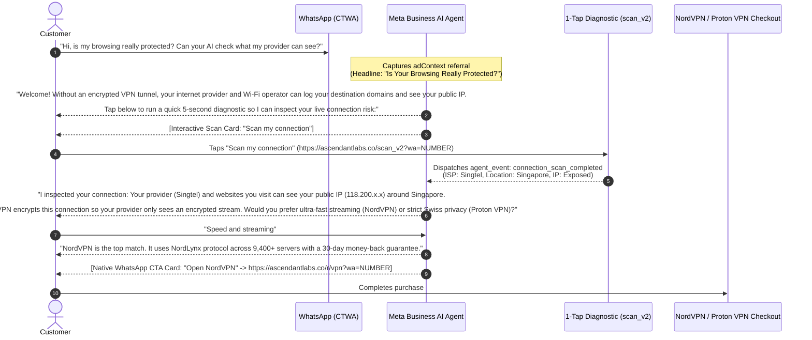

# 🚀 Meta Click-to-WhatsApp (CTWA) & Meta Business AI (MBA) Master Playbook (2026 Edition)
## Core Campaign: "Is Your Browsing Really Protected? Chat With Our AI Agent on WhatsApp"

---

## 🏆 1. The Core Creative: Handheld Mobile WhatsApp AI Inspection

- **Asset Reference**: [`variant-7-ai-browsing-protection.jpg`](file:///Users/kirkzhang/Documents/Antigravity/ascendant_labs/ads/creatives/ctwa/variant-7-ai-browsing-protection.jpg)
- **Format**: 1:1 Square (1080 × 1080 px) / Mobile Native
- **Visual Composition**: Macro photo of a smartphone held in hand in a warm aesthetic Scandinavian room. The phone screen displays an authentic WhatsApp chat with **"AI Privacy Assistant"** showing an active risk diagnosis: *"AI Diagnostic Report: Your browsing traffic is exposed to your internet provider (Risk Level: 85% Exposed)"*. Bold serif headline at the top: `IS YOUR BROWSING REALLY PROTECTED?`.
- **No On-Image CTA Button**: Bottom 25% of the image is left clean and uncluttered so Meta natively renders the **`Send WhatsApp Message`** CTA bar.

---

## 💡 2. Why This Creative Format is the #1 Best Practice for CTWA Ads (2026)

```text
┌─────────────────────────────────────────────────────────────┐
│ 👤 Ascendant Labs • Sponsored                            ...│
│ 📝 Did you know your ISP logs every search & website? 🔍    │
├─────────────────────────────────────────────────────────────┤
│                                                             │
│              IS YOUR BROWSING REALLY PROTECTED?             │
│                                                             │
│                     ┌──────────────┐                        │
│                     │  📱 iPhone   │                        │
│                     │  WhatsApp:   │                        │
│                     │  AI Privacy  │                        │
│                     │  Advisor     │                        │
│                     │  85% Risk    │                        │
│                     └──────────────┘                        │
│                                                             │
├─────────────────────────────────────────────────────────────┤
│ 💬 Is Your Browsing Really Protected? 🛡️                    │
│    Chat with our AI agent on WhatsApp • Free 5-sec check     │
│    [ 💬 Send WhatsApp Message ] <── Meta Native CTA Button  │
└─────────────────────────────────────────────────────────────┘
```

### The 4 Pillars of CTWA Creative Performance:
1. **Native In-Feed Camouflage (Zero "Banner Blindness")**:
   * Users scroll past corporate graphic banners and cartoonish illustrations.
   * A realistic photo of someone holding a smartphone displaying WhatsApp looks 100% native in Instagram/Facebook feeds, stopping thumbs instantly.
2. **Cognitive Action Match**:
   * When users see a WhatsApp conversation on a phone, their brain immediately connects the action: *"If I tap this ad, I will open WhatsApp on my own phone and chat with an AI just like the picture."*
   * This eliminates post-click hesitation and drives high-intent conversation starts.
3. **No On-Image CTA Conflict**:
   * Meta injects its own high-contrast green `Send WhatsApp Message` bar underneath the image. Having a duplicate fake button on the image causes visual clutter and looks spammy. Leaving the bottom clean maximizes the impact of Meta's native button.
4. **Instant 0-Second AI Continuity (1:1 Message Match)**:
   * The ad headline, pre-filled icebreaker, and AI agent's opening line all share the exact same phrasing: *"Is my browsing really protected?"*. Zero message mismatch prevents instant drop-offs.

---

## 📝 3. Ready-to-Launch Ad Copy Package

### 🎯 Primary Ad Copy (Feeds & Stories):
* **Primary Text**:
  > Did you know that every website you open, search you make, and video you stream is logged by your internet provider and visible to network operators? 🔍
  > 
  > **Is your browsing really protected?** Chat with our AI security assistant on WhatsApp to run a free 5-second connection audit and discover how to lock down your network.
* **Headline**: Is Your Browsing Really Protected? 🛡️
* **Description**: Chat with our WhatsApp AI • Free 5-sec risk audit
* **Native Meta CTA Button**: `Send WhatsApp Message`
* **Pre-Filled Icebreaker Message** *(Configured in Meta Ad Message Template)*:
  > *"Hi, is my browsing really protected? Can your AI check what my provider can see?"*

---

## 🤖 4. Meta Business AI (MBA) Conversation Flow & SPIN Close

When a user taps the ad and sends the pre-filled icebreaker, your MBA agent handles the sale through a compressed SPIN sequence:



---

## 💰 5. High-ARPU Targeting Strategy (Willingness-to-Pay Focus)

> [!IMPORTANT]
> **Exclude Low-ARPU Markets**: Exclude India, Pakistan, Bangladesh, Nigeria, and Philippines. They generate cheap message clicks on Meta, but have **near-zero conversion (<0.2%) to paid $40–$100/yr VPN subscriptions**.

### 🌍 High-ARPU Target Countries

| Tier | Target Countries | Why They Pay For VPNs | Primary Offer |
| :--- | :--- | :--- | :--- |
| **Tier 1 (High ARPU + High WhatsApp Penetration)** | 🇬🇧 **United Kingdom**<br>🇪🇸 **Spain**<br>🇩🇪 **Germany**<br>🇮🇹 **Italy**<br>🇳🇱 **Netherlands**<br>🇫🇷 **France**<br>🇨🇭 **Switzerland** | • Strict ISP logging & heavy copyright fines (DE/UK)<br>• High sports streaming demand (Premier League, F1, Champions League)<br>• High credit card penetration and $40k–$85k GDP/capita | **NordVPN** (Speed, Streaming, Full Security)<br>**Proton VPN** (Swiss Privacy, Open-Source) |
| **Tier 1 (APAC High-Income Hubs)** | 🇸🇬 **Singapore**<br>🇦🇺 **Australia**<br>🇳🇿 **New Zealand**<br>🇭🇰 **Hong Kong** | • Top-tier purchasing power ($50k–$90k GDP/capita)<br>• Massive expat & international travel community<br>• High awareness of digital privacy & public Wi-Fi risks | **NordVPN** |
| **Tier 1 (High-Income Gulf / GCC)** | 🇦🇪 **UAE**<br>🇸🇦 **Saudi Arabia**<br>🇶🇦 **Qatar**<br>🇰🇼 **Kuwait** | • Ubiquitous WhatsApp daily usage (>95%)<br>• Strict local VoIP/content restrictions create urgent necessity<br>• Very high disposable income and premium brand preference | **NordVPN** (Obfuscated servers, High-speed streaming) |
| **Tier 1 (North America High-Intent)** | 🇺🇸 **United States**<br>🇨🇦 **Canada** | • Largest overall VPN market worldwide<br>• Target mobile users, travelers, digital nomads, crypto/tech workers, and soccer/sports fans who use WhatsApp | **NordVPN** |

---

## 🛠️ 6. Quick Launch Checklist

1. **Upload Winning Ad Creative**:
   * Asset: [`ads/creatives/ctwa/variant-7-ai-browsing-protection.jpg`](file:///Users/kirkzhang/Documents/Antigravity/ascendant_labs/ads/creatives/ctwa/variant-7-ai-browsing-protection.jpg)
   * Placement: Mobile Feed, Instagram Reels, Stories (1:1 Square).
2. **Configure Message Template**:
   * Pre-filled text: `"Hi, is my browsing really protected? Can your AI check what my provider can see?"`
3. **Verify MBA Agent Backend**:
   ```bash
   node functions/scripts/sync_mba.js
   ```
4. **Evaluate Multi-Turn Agent Handling**:
   ```bash
   node functions/scripts/eval_mba.js --scenario=vpn-beginner
   ```
    Scan-->>Webhook: POST /api/scan-complete
    Webhook-->>MBA: Dispatches agent_event: connection_scan_completed<br/>(ISP: Singtel/BT/Comcast, IP: Exposed, Area: Singapore/London)
    MBA-->>Customer: "I inspected your connection: Your provider (Singtel) and websites you visit can see your public IP (118.200.x.x) around Singapore.<br/><br/>A verified VPN encrypts this connection so your provider only sees encrypted traffic. Would you prefer ultra-fast streaming (NordVPN) or strict Swiss privacy (Proton VPN)?"
    Customer->>MBA: "Speed and streaming"
    MBA-->>Customer: "NordVPN is the top match. It uses the NordLynx protocol across 9,400+ servers with a 30-day money-back guarantee."
    MBA-->>Customer: [Native WhatsApp CTA Card: "Open NordVPN" -> https://ascendantlabs.co/r/vpn?wa=NUMBER]
    Customer->>Checkout: Completes purchase with 30-day money-back guarantee
    Checkout-->>Webhook: CAPI purchase event recorded
```

---

## 🚫 5. Non-EU High-ARPU Targeting Matrix (Strict EU Exclusion)

> [!IMPORTANT]
> **EU is Excluded**: Under EU/EEA GDPR regulations, Meta blocks or heavily throttles **Click-to-WhatsApp Conversational CAPI attribution (`ctwa_clid`)** and downstream conversion telemetry.
> **Low-ARPU is Excluded**: Exclude India, Pakistan, Bangladesh, Nigeria, Philippines (<0.2% conversion to paid $40–$100/yr VPNs).

### 🌍 Approved Target Markets (Full CAPI CTWA Support & High Willingness to Pay):
* 🇬🇧 **United Kingdom** *(Post-Brexit — #1 European VPN market, >85% WhatsApp usage)*
* 🇸🇬 **Singapore** *(Local trust with your +65 number, $85k+ GDP/capita)*
* 🇦🇪 **UAE**, 🇸🇦 **Saudi Arabia**, 🇶🇦 **Qatar** *(>95% WhatsApp usage, urgent VoIP/streaming bypass need)*
* 🇦🇺 **Australia** & 🇳🇿 **New Zealand** *(High credit card penetration, English-native)*
* 🇨🇭 **Switzerland** & 🇳🇴 **Norway** *(Non-EU Europe, highest GDP per capita)*
* 🇺🇸 **United States** & 🇨🇦 **Canada** *(Largest overall market)*

---

## 🛠️ 6. Quick Launch Checklist

1. **Copy Prompt from Playbook**:
   * Open [`ads/prompts/ctwa_funnel/creative_prompts_suite.md`](file:///Users/kirkzhang/Documents/Antigravity/ascendant_labs/ads/prompts/ctwa_funnel/creative_prompts_suite.md) and generate Variant 1–4 in your preferred generator.
2. **Setup Message Template in Meta Ads Manager**:
   * Pre-filled text: `"Hi, is my browsing really protected? Can your WhatsApp AI advisor run a 5-sec audit on my connection?"`
3. **Verify MBA Agent**:
   ```bash
   node functions/scripts/sync_mba.js
   ```
